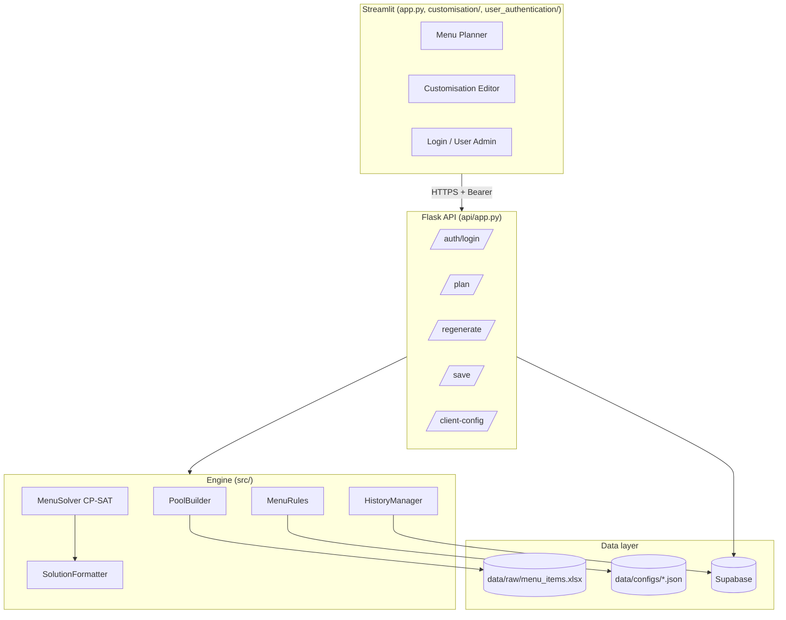
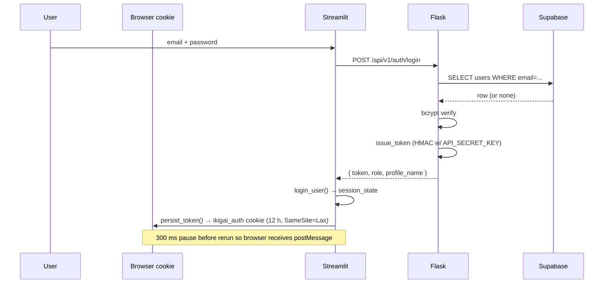
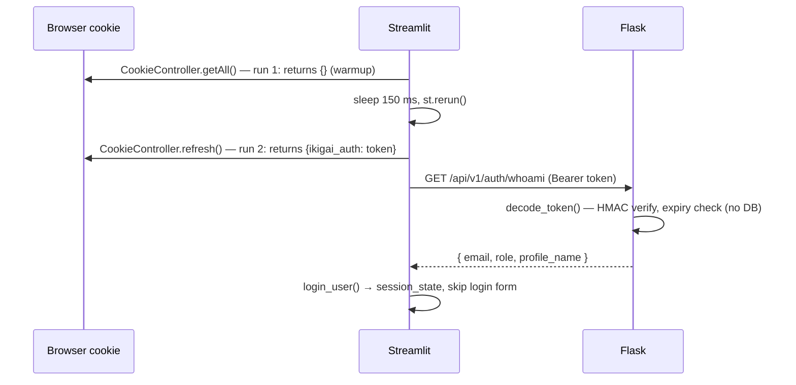
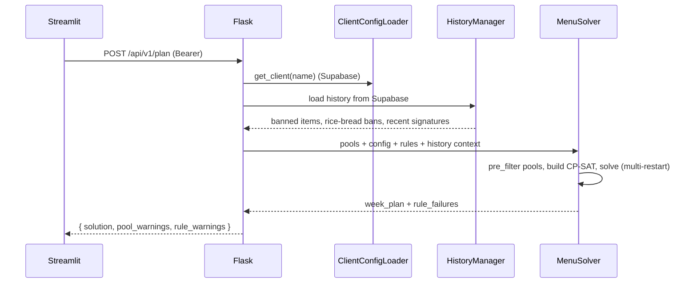

# Architecture

## Layer overview

| Layer | Location | Responsibility |
|---|---|---|
| Frontend | `app.py`, `customisation/`, `user_authentication/`, `ui/` | Streamlit views, login form, API client |
| API | `api/app.py`, `api/auth.py`, `api/concurrency.py`, `api/logging_config.py`, `api/metrics.py` | REST surface, bearer-token auth, concurrent-solve gate, structured logging, in-process counters |
| Solver | `src/solver/` | CP-SAT model, multi-restart strategy, regeneration, solution formatting |
| Rules | `src/menu_rules/` | Hard/soft/pre-filter constraints, loaded from JSON |
| Preprocessor | `src/preprocessor/` | Excel ingest, column mapping, data cleanse, per-slot pool build |
| Client/History | `src/client/`, `src/history/` | Supabase-backed client config and menu history |
| Shared | `src/db.py`, `src/constants.py` | Supabase singleton, slot/flag constants |

## Key design choices

- **Cell-based CP-SAT:** one bool variable per `(day, slot, candidate item)`. Enables per-item bonuses / penalties and targeted regeneration.
- **Two-phase rules:**
  1. `pre_filter_pool()` — cheap removals before CP-SAT vars exist.
  2. `apply()` + `get_objective_terms()` — hard constraints and soft bonuses / penalties on the model.
- **Hard vs. soft severity:** rules declare `severity = HARD` (default) or `SOFT`. A hard rule that raises in `apply()` fails the solve instead of silently dropping the constraint; soft rules log + continue + surface in the response's `rule_warnings`.
- **No config cache:** `ClientConfigLoader` reads Supabase on every call so edits are live with no restart. Per-request memoization on Flask's `g` avoids the intra-request round trips.
- **Dynamic worker allocation:** `api/concurrency.py` caps concurrent solves (`MAX_RUNNING=2`) and tunes CP-SAT worker count to RAM (1 active → 9 workers, 2 active → 5 each).
- **History split:** `menu_history` is item-level (one row per `(date, slot, item)`), `week_signatures` is week-level (a deterministic `|`-delimited hash of a saved week). The former drives item cooldown; the latter drives week-signature cooldown.
- **Optimistic concurrency:** the `clients` table carries a `version` column. `GET /client-config` returns it as an ETag; `PUT` must send it back, mismatch returns 409 so two admins editing the same client can't last-write-wins.

## Key flows

### Login

### Session restore (hard refresh / new tab)

### Generate menu

### Save (overwrite semantics)

Streamlit → `POST /api/v1/save` → `HistoryManager.save()` first **deletes** any existing rows for the same `(client_name, service_date)` (and `(client_name, week_start)` for `week_signatures`), then inserts the new rows. Re-saving a week therefore replaces the prior plan instead of accumulating. Color suffixes (`(R)`, `(Y)`, …) are stripped before persistence so cooldown matching is color-agnostic. UNIQUE indexes on `(client_name, service_date, slot, item_base)` and `(client_name, week_start, week_signature)` are the safety net against double-insert under a retried `/save`.

### Pre-flight rule diagnostics

Before the solver runs, `api/app.py::_run_preflight` calls every rule's `BaseMenuRule.diagnose(ctx)` method against the assembled `DiagnoseContext` (pools, dates, day-types, history bans, client config). Results are aggregated by `src/menu_rules/diagnostics.py::run_diagnostics` and sorted by severity. A buggy rule's exception is converted to a `warning` Diagnostic — never `error` — so a regression in diagnose() code can't freeze the planner.

Endpoints:

- `POST /api/v1/diagnose` — pure read; runs the diagnostics and returns the structured envelope. Replaces the old `/validate-pools`.
- `POST /api/v1/plan` — runs the same diagnostics first. If any `severity=error` is present, returns **HTTP 422** with `rule_diagnostics` + `summary` and **skips the solver entirely**. Otherwise the solver runs and the diagnostics ride along on the 200 response.

The Streamlit UI catches `RuleDiagnosticsBlockedError` (the 422 path) and renders an inline expander showing the blocked rules + actionable suggestions; on 200, the expander shows any warnings/info entries collapsed by default. See `docs/api.md` for the response shape.

### Generate (with history-first read)

The Streamlit **Generate Menu Plan** button is deterministic for already-saved dates: it first hits `GET /api/v1/saved-plan?client_name&start_date&num_days`. If every requested weekday has saved rows, the response carries `exists: true` and the UI renders that saved plan with a "Loaded from history" badge. Otherwise (`exists: false`) the UI falls back to `POST /api/v1/plan` and runs the solver as usual.

`/saved-plan` is a pure read — it never invokes the solver. Color suffixes are re-attached server-side from the Excel ontology so the UI's renderer doesn't need a separate code path for saved vs fresh plans.

### Regenerate

Streamlit → `POST /api/v1/regenerate` → `MenuRegenerator` locks every cell not marked for replacement and re-runs the solver. A similarity penalty steers the solver away from re-picking the same items.

## Schema migrations

Two SQL files live under `scripts/`:

- `create_tables.sql` defines configuration tables (`clients`,
  `menu_categories`, `slot_count_overrides`, `theme_overrides`,
  `app_settings`) and their RLS policies.
- `create_history_tables.sql` defines `menu_history` and
  `week_signatures` (with FK + UNIQUE INDEX safety nets) and their RLS
  policies.
- `create_users_table.sql` defines the `users` table for auth.

Run order: `create_tables.sql` → `create_history_tables.sql` →
`create_users_table.sql`. All three are idempotent — re-running them
is a no-op once the schema is in place. See `docs/REVIEW.md` for the
history of the schema-duplication fix that consolidated the
`menu_history` / `week_signatures` DDL into a single file.
