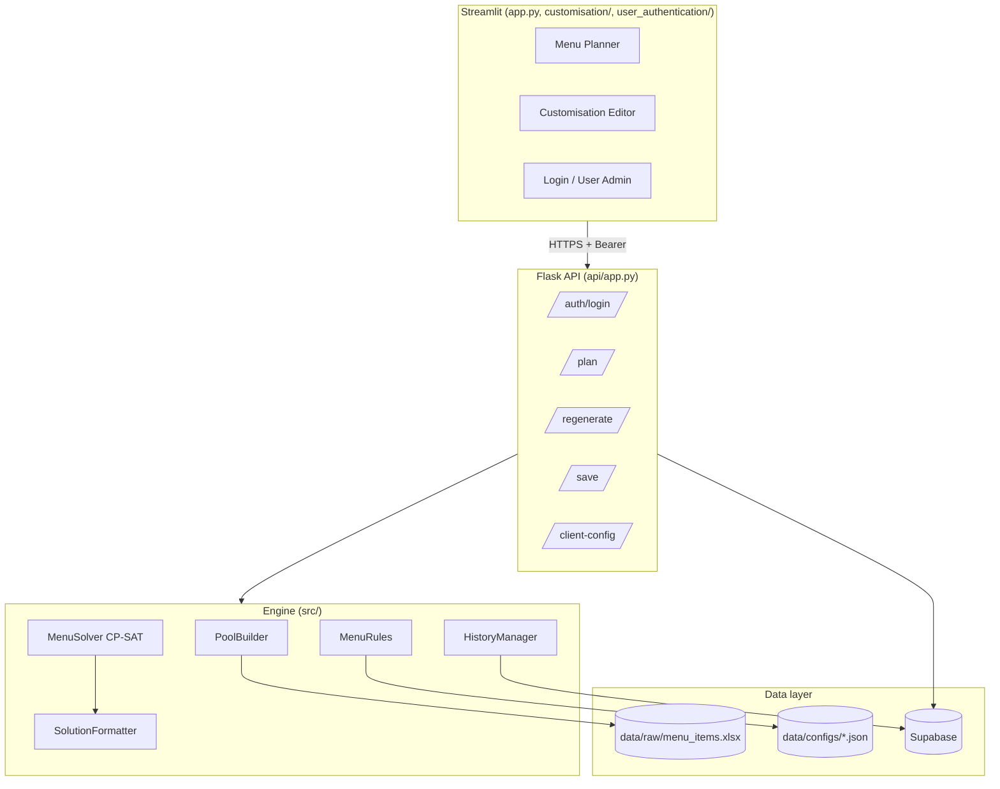
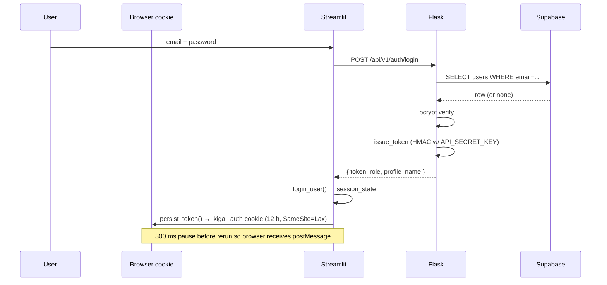
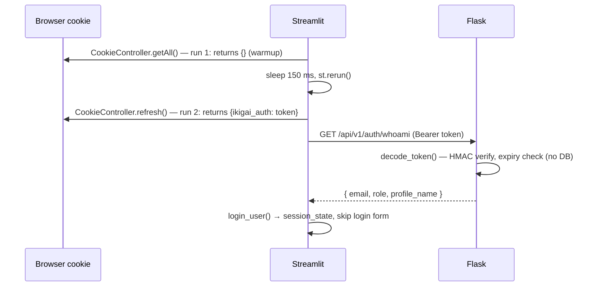
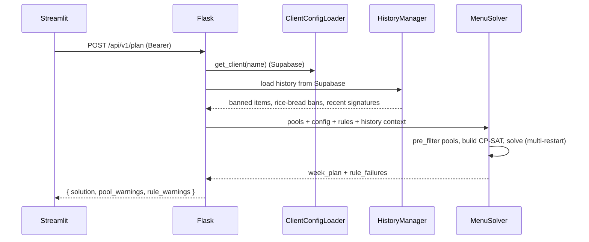

# Architecture

```mermaid
graph TD
    subgraph UI ["Streamlit (app.py, customisation/, user_authentication/)"]
        MP[Menu Planner]
        CE[Customisation Editor]
        AU[Login / User Admin]
    end

    subgraph API ["Flask API (api/app.py)"]
        AUTH[/auth/login/]
        PLAN[/plan/]
        REGEN[/regenerate/]
        SAVE[/save/]
        CONFIG[/client-config/]
    end

    subgraph Core ["Engine (src/)"]
        POOLS[PoolBuilder]
        SOLVER[MenuSolver CP-SAT]
        RULES[MenuRules]
        HIST[HistoryManager]
        FMT[SolutionFormatter]
    end

    subgraph Data ["Data layer"]
        XLS[(data/raw/menu_items.xlsx)]
        CFG[(data/configs/*.json)]
        SUPA[(Supabase)]
    end

    UI -- HTTPS + Bearer --> API
    API --> Core
    POOLS --> XLS
    RULES --> CFG
    HIST --> SUPA
    SOLVER --> FMT
    API --> SUPA
```

## Layer overview

| Layer | Location | Responsibility |
|---|---|---|
| Frontend | `app.py`, `customisation/`, `user_authentication/`, `ui/` | Streamlit views, login form, API client |
| API | `api/app.py`, `api/auth.py`, `api/concurrency.py`, `api/logging_config.py`, `api/metrics.py` | REST surface, bearer-token auth, concurrent-solve gate, structured logging, in-process counters |
| Solver | `src/solver/` | CP-SAT model, multi-restart strategy, regeneration, solution formatting |
| Rules | `src/menu_rules/` | Hard/soft/pre-filter constraints, loaded from JSON |
| Preprocessor | `src/preprocessor/` | Excel ingest, column mapping, data cleanse, per-slot pool build |
| Client/History | `src/client/`, `src/history/` | Supabase-backed client config and menu history |
| Shared | `src/db.py`, `src/constants.py` | Supabase singleton, slot/flag constants |

## Key design choices

- **Cell-based CP-SAT:** one bool variable per `(day, slot, candidate item)`. Enables per-item bonuses / penalties and targeted regeneration.
- **Two-phase rules:**
  1. `pre_filter_pool()` — cheap removals before CP-SAT vars exist.
  2. `apply()` + `get_objective_terms()` — hard constraints and soft bonuses / penalties on the model.
- **Hard vs. soft severity:** rules declare `severity = HARD` (default) or `SOFT`. A hard rule that raises in `apply()` fails the solve instead of silently dropping the constraint; soft rules log + continue + surface in the response's `rule_warnings`.
- **No config cache:** `ClientConfigLoader` reads Supabase on every call so edits are live with no restart. Per-request memoization on Flask's `g` avoids the intra-request round trips.
- **Dynamic worker allocation:** `api/concurrency.py` caps concurrent solves (`MAX_RUNNING=2`) and tunes CP-SAT worker count to RAM (1 active → 9 workers, 2 active → 5 each).
- **History split:** `menu_history` is day-level (one row per `(client, date)` whose `menu` jsonb nests each counter's `{slot: item}` map), `week_signatures` is week-level (a deterministic `|`-delimited hash of a saved week, prefixed with its counter). The former drives item cooldown; the latter drives week-signature cooldown. `HistoryManager.expand_menu_rows()` flattens the jsonb back into the long `(date, slot, item_base, counter_name)` frame the cooldown rules are written against, so the storage shape and the in-memory shape can differ without either side caring.
- **Counters:** a client's serving lines live in `clients.counters` (jsonb), each with its own `categories`, `slot_counts`, and `theme_map`. The solver plans one counter at a time — `ClientConfig` projects the selected counter's slots/themes onto the same fields the engine has always read, so counters are a config-layer concept the solver never has to know about. Cooldowns and saved history are scoped per counter, since three lines sharing one cooldown window would exhaust the item pools three times as fast.
- **Optimistic concurrency:** the `clients` table carries a `version` column. `GET /client-config` returns it as an ETag; `PUT` must send it back, mismatch returns 409 so two admins editing the same client can't last-write-wins. Because every counter now lives in one row, that check also serialises edits to *different* counters of the same client.

## Key flows

### Login

```mermaid
sequenceDiagram
    participant U as User
    participant B as Browser cookie
    participant S as Streamlit
    participant F as Flask
    participant DB as Supabase

    U->>S: email + password
    S->>F: POST /api/v1/auth/login
    F->>DB: SELECT users WHERE email=...
    DB-->>F: row (or none)
    F->>F: bcrypt verify
    F->>F: issue_token (HMAC w/ API_SECRET_KEY)
    F-->>S: { token, role, profile_name }
    S->>S: login_user() → session_state
    S->>B: persist_token() → ikigai_auth cookie (12 h, SameSite=Lax)
    Note over S,B: 300 ms pause before rerun so browser receives postMessage
```

### Session restore (hard refresh / new tab)

```mermaid
sequenceDiagram
    participant B as Browser cookie
    participant S as Streamlit
    participant F as Flask

    S->>B: CookieController.getAll() — run 1: returns {} (warmup)
    S->>S: sleep 150 ms, st.rerun()
    S->>B: CookieController.refresh() — run 2: returns {ikigai_auth: token}
    S->>F: GET /api/v1/auth/whoami (Bearer token)
    F->>F: decode_token() — HMAC verify, expiry check (no DB)
    F-->>S: { email, role, profile_name }
    S->>S: login_user() → session_state, skip login form
```

### Generate menu

```mermaid
sequenceDiagram
    participant S as Streamlit
    participant F as Flask
    participant L as ClientConfigLoader
    participant H as HistoryManager
    participant M as MenuSolver

    S->>F: POST /api/v1/plan (Bearer)
    F->>L: get_client(name) (Supabase)
    F->>H: load history from Supabase
    H-->>F: banned items, rice-bread bans, recent signatures
    F->>M: pools + config + rules + history context
    M->>M: pre_filter pools, build CP-SAT, solve (multi-restart)
    M-->>F: week_plan + rule_failures
    F-->>S: { solution, pool_warnings, rule_warnings }
```

### Save (overwrite semantics)

Streamlit → `POST /api/v1/save` → `HistoryManager.save()` reads the existing `menu_history` rows for the requested `(client_name, service_date)` pairs, replaces just the saving counter's entry inside each day's `menu` jsonb, and upserts on the `(client_name, service_date)` primary key. Re-saving a week therefore replaces the prior plan for that serving line while the other lines' menus for those days survive. `week_signatures` rows are stamped `counter=<name>|…` and the week's rows for this counter (plus any prefix-less legacy row) are deleted before the new one is inserted, so a multi-counter client keeps one signature per line per week. Color suffixes (`(R)`, `(Y)`, …) are stripped before persistence so cooldown matching is color-agnostic.

### Pre-flight rule diagnostics

Before the solver runs, `api/app.py::_run_preflight` calls every rule's `BaseMenuRule.diagnose(ctx)` method against the assembled `DiagnoseContext` (pools, dates, day-types, history bans, client config). Results are aggregated by `src/menu_rules/diagnostics.py::run_diagnostics` and sorted by severity. A buggy rule's exception is converted to a `warning` Diagnostic — never `error` — so a regression in diagnose() code can't freeze the planner.

Endpoints:

- `POST /api/v1/diagnose` — pure read; runs the diagnostics and returns the structured envelope. Replaces the old `/validate-pools`.
- `POST /api/v1/plan` — runs the same diagnostics first. If any `severity=error` is present, returns **HTTP 422** with `rule_diagnostics` + `summary` and **skips the solver entirely**. Otherwise the solver runs and the diagnostics ride along on the 200 response.

The Streamlit UI catches `RuleDiagnosticsBlockedError` (the 422 path) and renders an inline expander showing the blocked rules + actionable suggestions; on 200, the expander shows any warnings/info entries collapsed by default. See `docs/api.md` for the response shape.

### Generate (with history-first read)

The Streamlit **Generate Menu Plan** button is deterministic for already-saved dates: it first hits `GET /api/v1/saved-plan?client_name&start_date&num_days`. If every requested weekday has saved rows, the response carries `exists: true` and the UI renders that saved plan with a "Loaded from history" badge. Otherwise (`exists: false`) the UI falls back to `POST /api/v1/plan` and runs the solver as usual.

`/saved-plan` is a pure read — it never invokes the solver. Color suffixes are re-attached server-side from the Excel ontology so the UI's renderer doesn't need a separate code path for saved vs fresh plans.

### Regenerate

Streamlit → `POST /api/v1/regenerate` → `MenuRegenerator` locks every cell not marked for replacement and re-runs the solver. A similarity penalty steers the solver away from re-picking the same items.

## Schema migrations

Two SQL files live under `scripts/`:

- `create_tables.sql` defines `clients` (with `counters`, `city`,
  `serve_weekends`, `item_cooldown_days`, `source_pools`, `version`) and
  `app_settings`, plus their RLS policies and baseline settings rows.
- `create_history_tables.sql` defines `menu_history` (one jsonb row per
  client-day) and `week_signatures`, with FK + index safety nets and RLS
  policies.
- `migrate_to_counters.sql` upgrades a pre-counters database: it folds
  `menu_categories` / `slot_count_overrides` / `theme_overrides` into
  `clients.counters`, rolls long-form `menu_history` rows into one jsonb
  per client-day, and stamps existing week signatures with the default
  counter prefix. Old tables are left in place for verification; the
  DROPs are at the bottom of the file, to run by hand.
- `create_users_table.sql` defines the `users` table for auth. Only
  needed if the auth layer is wired back into `api/app.py` — the current
  build has no login path.

Run order: `create_tables.sql` → `create_history_tables.sql` →
`migrate_to_counters.sql` (upgrades only). All are idempotent —
re-running them is a no-op once the schema is in place. See
`docs/REVIEW.md` for the history of the schema-duplication fix that
consolidated the `menu_history` / `week_signatures` DDL into a single
file.
